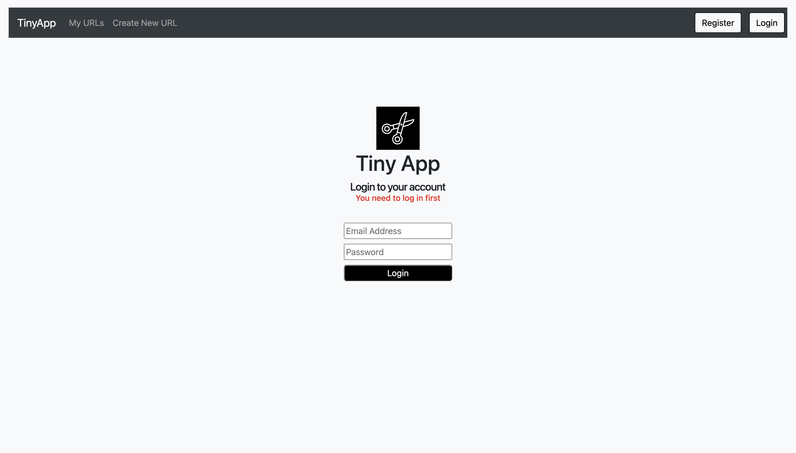
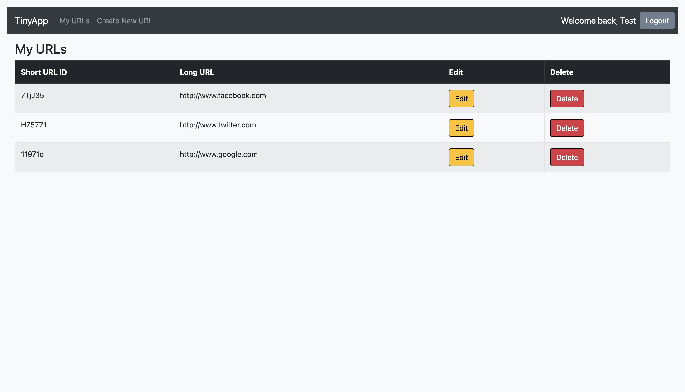
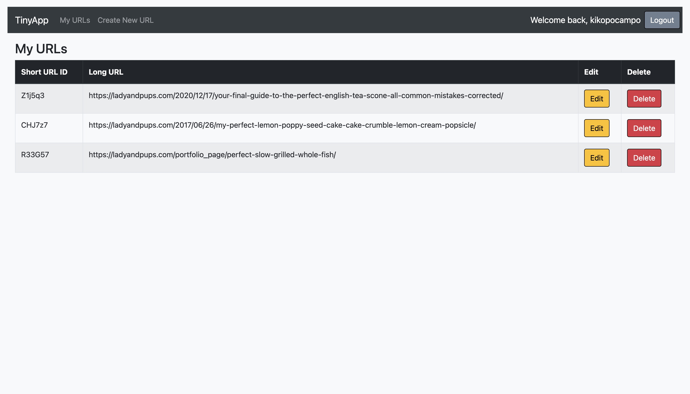
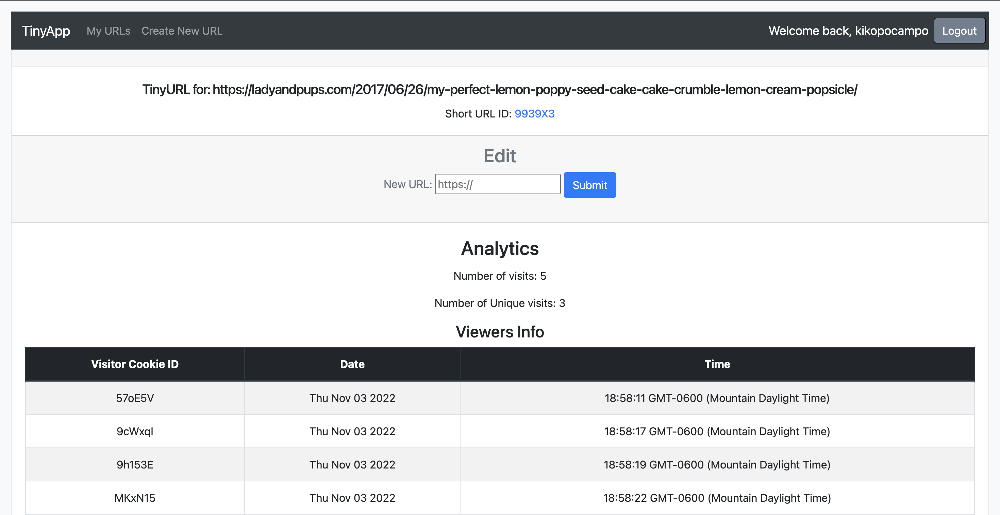

# TinyApp Project

**TinyApp** is a full stack web application built with Node and Express that allows users to shorten long URLs *(à la bit.ly)*.

## Final Product

## Dependencies

- Node.js
- Express
- EJS
- bcryptjs
- cookie-session

## Getting Started

- Install all dependencies (using the `npm install` command).
- Run the app by using the `npm start` command.
- In your browser, type http://localhost:8080/ to begin using the app.

## Usage

- URLs http://localhost:8080/u/Z1j5q3, *et al.* will be created. These can now be used as a link to redirect to the specific site without the lengthy url by anyone.
- A unique code is created everytime a url is generated.
- The original URL can be replaced if a unique code is already registered.

- Checks the activity of the link. 
- Counts the number of views in total and unique guests visits (owner visits are not counted)
- Displays a table containing info based on guest ID, time, and date of activity.
